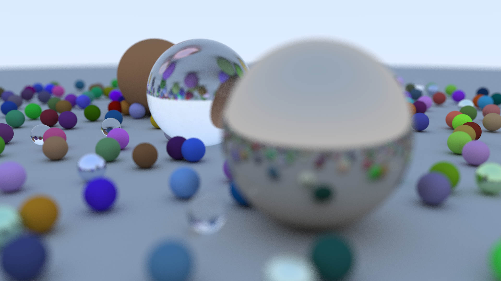

# Ray Tracing in a Weekend
## But implemented in Rust

This was a fun project to both increase my knowledge of ray tracers,
but also to help me learn Rust which is a cool new memory-safe
programming language. The original guide for the ray tracing code
was written by [Peter Shirley](https://in1weekend.blogspot.com/)
and implemented in C++.

